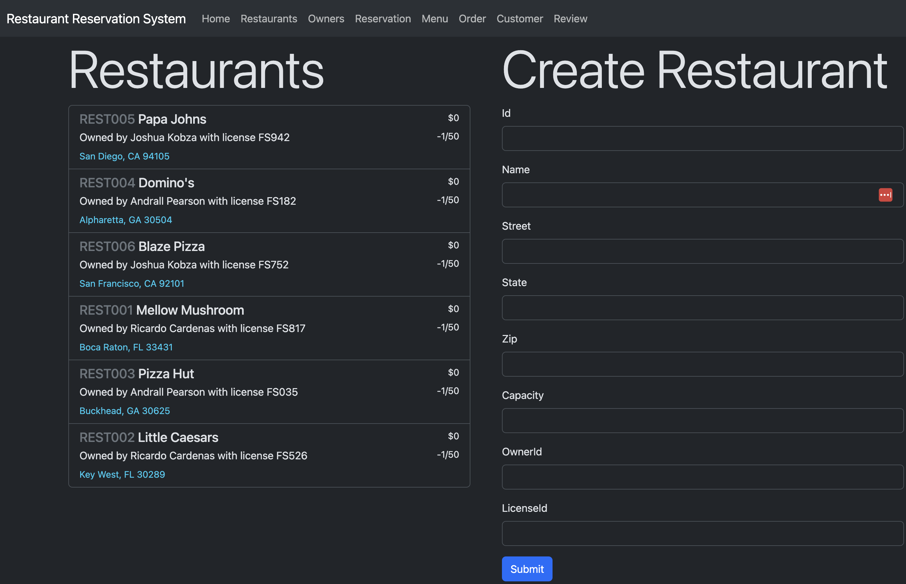

# Restaurant Reservation System
_Project for CS 2340 Objects & Design_

Group members: Bryce Hanna, Vivian Gu, Logan Tao, Korina Goldsmith, and Varun Warrier_

## Quickstart
Open the project in Intellij and either use one of two preconfigured run options: CLI or Web. The former will allow you to enter commands in the format provided for the testing phases of the project, and the latter gives you a nice web interface to go through. 

## Problem Description
The requirements for the project can be found [in the assets folder](assets/requirements.pdf)

## Use Case Diagram

## Domain Models

## Design Case Diagram

## Sequence Diagrams

Hungry Customer

Ingredients

View Owners

## Motivation and Changes
https://drive.google.com/file/d/1PayMaahy6heJ8GWLkcxIboq86tw7tfBv/view?usp=sharing

## Final Presentation
https://docs.google.com/presentation/d/1l1Z_Dq2AKqK8sqsJ6ZWNhtdbS00mnmFRUCRYA7ExQIs/edit#slide=id.p
